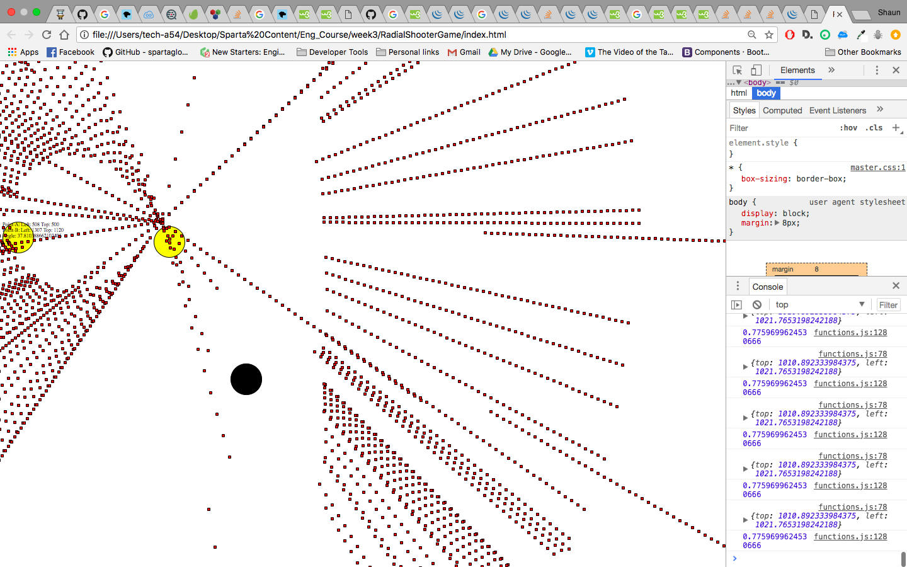

# Point Defence

##Introduction:

Point defence is a fast paced 2D shooter. Where your objective is simple. That is to survive for as long as you can.

If you get hit you die.

The more enemies you shoot the higher your score will be.

You have two options for your weapon: 

* A machine gun that will hit one target.
* Or a beam weapon that will pierce through multiple.

How long can you survive?

Play here [Game](https://shaun273.github.io/RadialShooterGame/)

###There are two modes
####Endless:
Endless is a mode where the enemies will constantly spawn when they are killed. Making a never ending game mode.

####Waves:
In this mode the enemies will be spawn in waves. The number of enemies will increase by 5 every wave.

###Themes
There are also two different themes to pick from. The zombie theme and the Penguin theme. These can be selected from the options.

##How to play
When you launch the page you will be presented with the rules and instructions. 

After clicking play you will be presented with the options menu where you will be able to pick your mode and number of enemies. 

Click confirm and you will start the game.

###To control
Use your mouse to control the direction the you are firing. 

##Development

###Approach
The project started off with the structure of the page, drawing the line div, the dot and a few test dots.

I moved on to the logic and here I encountered most of my problems.

###Problems:
####Collision detection:
Angles caused a big problem for the collision of the line with an enemy.

Detection used the left and top properties of each element.

Tried methods:

* Two simple rectangles
* Line and circle

Overcame by splitting the line up into points and testing if each point is within the circle. 

This image shows an error I had when trying to detect collisions. Each red dot is a location tested for detection.

The calculation to detect had an error in the logic where the starting loaction for the line was wrong but the angle was correct. This made strange patches of areas that did not detect anything. It took a long time to find and fix this math error.

###Positioning the line
A big problem was that when rotating the line about the center, the offset of the line changed depending on which side is closer to the top of left.

Multiple if statement needed to be used to correctly position the line.

Unfortun
